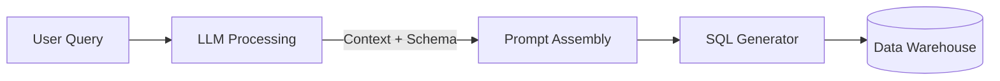

The **AI Query Engine** is the deeply optimized component of Prov AI that converts your natural language questions into executable database queries and narrative insights. 

<Note>
  Our AI Engine is designed for accuracy and safety. It never trains on your actual row-level data.
</Note>

---

## Core Responsibilities

- **Understand User Intent:** Map business language to relational data correctly.
- **Generate Syntactical SQL:** Output 100% compliant SQL for the target warehouse.
- **Maintain Conversation Context:** Track multi-turn conversations for follow-up questions.
- **Optimize Queries:** Apply best practices (e.g., partitioning, indexing rules) into the SELECT statements.

---

## Architecture Components

<CardGroup cols={2}>
  <Card title="1. Large Language Model (LLM)" icon="brain">
    Interprets the semantics of natural language and generates structured internal outputs.
  </Card>
  <Card title="2. Prompt & Schema Layer" icon="layer-group">
    Injects context into the AI—this includes the Semantic Layer definitions, schema layout, and custom instructions.
  </Card>
  <Card title="3. Context Manager" icon="clock-rotate-left">
    Preserves the history of the conversation, allowing seamless drill-downs without repeating constraints.
  </Card>
  <Card title="4. SQL Generator" icon="code">
    The final compilation layer that guarantees the output is purely valid SQL before hitting the database.
  </Card>
</CardGroup>

---

## Execution Flow

<Frame>

</Frame>