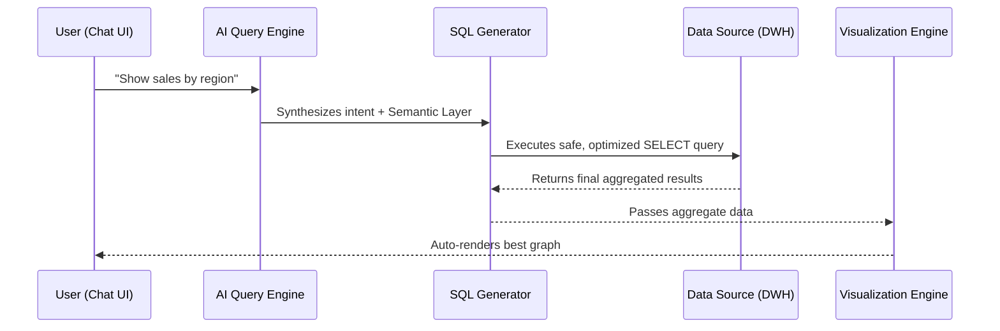

This platform is built as a modular AI-driven analytics system that never trains models on your raw database records.

<Card title="Security First" icon="lock">
  We process metadata, not raw row data! The Large Language Models only ever see schema definitions, sample headers, and your semantic metrics—never your sensitive raw records.
</Card>

---

## High-Level Architecture

The flow of information maps out securely from the user intent to the final visualization.

<Frame>

</Frame>

### Key Architectural Layers

1. **User Interface (Chat / Dashboard)**: Clean, intuitive frontend.
2. **AI Query Engine**: The intelligence layer powered by LLMs + context handling.
3. **SQL Generation Layer**: Transforms AI output into deterministic, dialect-specific SQL (e.g. Postgres, Snowflake).
4. **Data Sources**: Your actual Data Warehouse or Database where the execution safely happens.
5. **Visualization Engine**: Automatically maps data sets to interactive React-based charts.