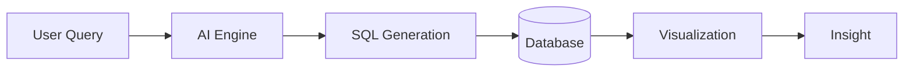

<Note>
  This platform enables true **Conversational Analytics**. You no longer need to know SQL to extract meaningful insights from your business data!
</Note>

## What is this platform?

This platform is an **AI-powered Generative BI (Business Intelligence) system** that allows users to interact with data using natural language. 

Instead of writing SQL or building dashboards manually, users can simply ask questions like:

> *"Show last 6 months revenue by region"*

The system automatically:
1. Understands the intent behind your query.
2. Generates precise and optimized SQL.
3. Queries your connected data source safely.
4. Returns the ideal chart, data table, and a contextual narrative insight.

---

## Why this product?

Traditional BI tools require deep SQL knowledge, dashboard building skills, and a constant dependency on data teams to answer ad-hoc questions. This platform removes that friction completely.

<CardGroup cols={3}>
  <Card title="Conversational Analytics" icon="comments">
    Chat directly with your data for instant answers.
  </Card>
  <Card title="Instant Insights" icon="bolt">
    Generate beautiful charts and tables in seconds.
  </Card>
  <Card title="No-Code Exploration" icon="wand-magic-sparkles">
    Zero SQL or coding required for business users.
  </Card>
</CardGroup>

---

## Key Capabilities

- **Natural language → SQL generation**
- **Instant charts & dashboards**
- **Follow-up conversational queries**
- **AI-generated reports (stories)**
- **Semantic layer for consistent metrics**
- **Integration with major databases** (Snowflake, BigQuery, Postgres, etc.)

---

## Who is this for?

- **Business Users** → Ask questions, get answers instantly.
- **Data Analysts** → Faster exploration, transparent underlying SQL.
- **Product Teams** → Embed analytics directly into apps.
- **Executives** → High-level insights, KPI tracking & automated reports.

---

## How it works (high-level)

<Frame>

</Frame>