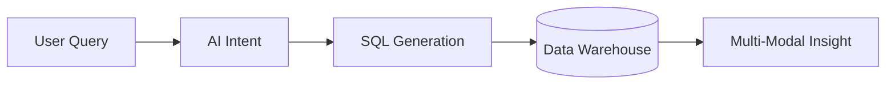

**Generated Insights** are the comprehensive AI-produced results returned after securely querying your data warehouse.

Instead of just returning a raw grid of numbers, Prov AI synthesizes the answer into a directly consumable format.

---

## What is included in an Insight?

When you ask a question, the AI automatically generates a complete insight package:

<CardGroup cols={3}>
  <Card title="Optimal Visualizations" icon="chart-simple">
    The AI selects the best possible chart (Bar, Line, Pie) to represent the data shape.
  </Card>
  <Card title="Data Tables" icon="table">
    A detailed, paginated data grid allowing users to inspect the raw aggregated output.
  </Card>
  <Card title="Summary Explanations" icon="paragraph">
    A short narrative text explaining *what* you are looking at and highlighting any immediate trends.
  </Card>
</CardGroup>

---

## The Generation Pipeline

<Frame>

</Frame>